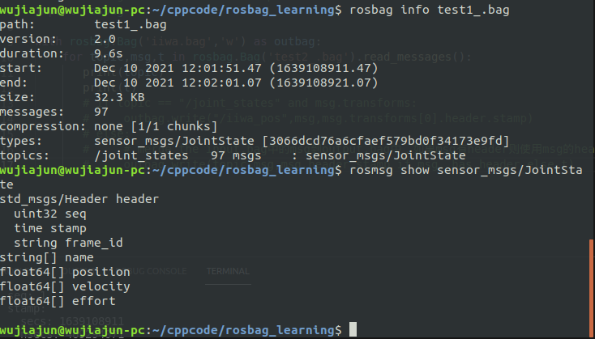
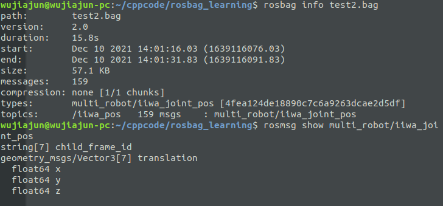
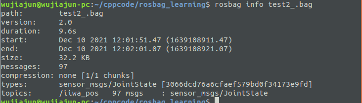

### Rosbag_CookBook 学习记录

---------------

_language:中文_

_programed by: Python_


#### The Demo #1 in the CookBook

-------------

```python
import rosbag
with rosbag.Bag('output.bag','w') as outbag:
    for topic,msg,t in rosbag.Bag('input.bag').read_messages():
        # 这将以"all transforms in the message share the same timestap"
        # 为假设代替tf的时间戳
        if topic == "/tf" and msg.transform:
            outbag.write(topic,msg,msg.transforms[0].header.stamp)
        else:
            outbag.write(topic,msg,msg.header.stamp if msg._has_header else t)
```

_官方解析:这将在消息的接收时间与生成时间有巨大差异时非常有用，例如在消息的接收时需要经过不可靠或者是缓慢的连接。_

_注意:这将可能导致消息在通过rosbag play播放时发布的顺序。_

==My demo==

```python
#!/usr/bin/env python
#coding=utf-8
import os,sys
os.chdir(sys.path[0])	#用于vscode无法读取当前文件夹内的文件时
import rosbag

with rosbag.Bag('test2_.bag','w') as outbag:
    for topic,msg,t in rosbag.Bag('test1_.bag').read_message():
        if topic=='/joint_states' and msg:
            # 读取/joint_states中的msg覆盖/iiwa_pos中的msg
            outbag.write('/iiwa_pos',msg,msg.header.stamp)
        else:
            # merge the input.bag 中的msg到output.bag中，如果msg中有header则使用
            # msg.header时间否则使用ROS时间。
            outbag.write(topic,msg,msg.header.stamp if msg._has_header else t)
```

test1_.bag是:



test2_.bag是:



在运行上面的代码后:



可以看到原来记录为Vector3消息的test2_.bag被覆盖为记录sensor_msgs/JointState.


#### The Demo #2 in the CookBook

-------------------

```python
import rosbag
import rospy

with rosbag.Bag('input.bag','a') as bag:
    from std_msgs.msg import String
    metadata_msg = String(data='my metadata')
    bag.write('/metadata',metadata_msg,rospy.Time(bag.get_end_time()))
```

_官方解析:注意，当添加一个带有时间戳的消息,且该消息早于最迟的时间戳时将会影响rosbag info报告的持续时间_


#### The Demo #3 in the CookBook

---------------

```python
import subprocess,yaml
info_dict=yaml.load(subprocess.Popen(['rosbag','info','--yaml','input.bag'],stdout=subprocess.PIPE).communicate()[0])
```

_官方解析:从代码中读取关于一个bag的信息_

==注:现在yaml.load需要指定Loader了==

```python
#!/usr/bin/env python
#coding=utf-8
import subprocess,yaml
import os,sys
os.chdir(sys.path[0])

info_dict=yaml.load(subprocess.Popen(['rosbag','info','--yaml','test1_.bag'],stdout=subprocess.PIPE).communicate()[0],Loader=yaml.FullLoader)
print(info_dict)
```


第二种方法：

```python
import yaml
from rosbag.bag import Bag
info_dict=yaml.load(Bag('input.bag','r')._get_yaml_info())
```

==注意:同样需要加入Loader参数==

```python
import yaml
from rosbag.bag import Bag
info_dict=yaml.load(Bag('test1_.bag','r')._get_yaml_info(),Loader=yaml.FullLoader)s
```


#### The Demo #4 in the CookBook

-----------

```python
import rosbag
bag = rosbag.Bag('input.bag')
topics = bag.get_type_and_topic_info()[1].keys()
types=[]
for i in range(0,len(bag.get_type_and_topic_info()[1].values())):
    types.append(bag.get_type_and_topic_info()[1].values()[i][0])
```

_可通过Debug的方式查看各个变量的内容_


#### The Demo #5 in the CookBook

-------------------------

```python
import rosbag
num_msgs = 100

with rosbag.Bag('output.bag','w') as outbag:
    for topic,msg,t in rosbag.Bag('input.bag').read_message():
        while num_msgs:
            outbag.write(topic,msg,t)
            num_msgs -= 1
```

_创建一个裁剪过的样本_


#### The Demo #6 in the CookBook

-----------------------------

```python
import sys
import rosbag
import time
import subprocess
import yaml
import rospy
import os 
import argparse
import math
from shutil import move

def status(length,percent):
    # 重定向到屏幕
    sys.stdout.write('\x1B[2K') #Erase entire current line 
    sys.stdout.write('\x1B[0E') #Move to the beginning of the current line
	progress="Progress:["
    for i in range(0,length):
        if i <length*percent:
            progress += '='
        else:
            progress += ' '
    progress += "] "+str(round(percent*100.0,2))+"%"）
    sys.stdout.write(progress)
    sys.stdout.flush()
    
def main(args):
    parser = argparse.ArgumentParser(description='Reorder a bagfile based on header timestamps.')
    parser.add_argument('bagfile',nargs=1,help='input bag file')
    parser.add_argument('--max-offset',nargs=1,help='max time offset (sec) to correct.',default='60',type=float)
    args = parser.parse_args()
    
    # Get bag duration
    bagfile = args.bagfile[0]
    
    info_dict = yaml.load(subprocess.Popen(['rosbag','info','--yaml',bagfile],stdout=subprocess.PIPE).communicate()[0])
    duration=info_dict['duration']
    start_time=info_dict['start']
    
    # 创建一个orig.bag文件
    orig = os.path.splitext(bagfile)[0]+".orig.bag"
    
    # 将文件移动到文件夹中，或者重命名文件
    move(bagfile,orig)
    
    with rosbag.Bag(bagfile,'w') as outbag:
        last_time = time.clock()
        for topic,msg,t in rosbag.Bag(orig).read_message():
            
            if time.clock()-last_time>.1:
                # 计算比率用于显示多少个'===='
                percent = (t.to_sec()-start_time) / duration
                status(40,percent)
                last_time = time.clock()
                
            if topic == "/tf" and msg.transforms:
                # 将所有的/tf信息提前放送1s!!!
                diff = math.fabs(msg.transforms[0].header.stamp.to_sec()-t.to_sec())
                # 当/tf消息的接收时间与生成时间之间相差大于1s时无需修改
                outbag.write(topic,msg,msg.transforms[0].header.stamp-rospy.Duration(1) if diff<args.max_offset else t)
            elif msg._has_header:
                diff = math.fabs(msg.header.stamp.to_sec()-t.to_sec())
                outbag.write(topic,msg,msg.header.stamp if diff<args.max_offset else t)
            else:
                outbag.write(topic,msg,t)
    status(40,1)
    print("\ndone")
    
    

if __name__ == "__main__":
    main(sys.argv[1:])
```


#### The Demo #7 in the CookBook

------------------

下面这段代码查看包文件中的消息，并在它们满足特定条件时将它们写入csv

```python
import sys
import os
import csv
import rosbag
import rospy
#####################################################
# DESCRIPTION:
# Creates CSV files of the robot joint states from a rosbag (for visualization with e.g. pybullet)
# 
# USAGE EXAMPLE:
# rosrun your package get_jsatate_csvs.py /root/catkin_ws/bagfiles your_bagfile.bag
######################################################

filename = sys.argv[2]
directory = sys.argv[1]
print("Reading the rosbag file")
if not directory.endswith("/"):
    directory += "/"
extension = ""
if not filename.endswith(".bag"):
    extension=".bag"
bag = rosbag.Bag(directory+filename+extension)

# 创建带有名字的文件夹(没有扩展名的)
results_dir = directory+filename[:-4]+"_results"
if not os.path.exists(results_dir):
    os.makedirs(results_dir)

print("Writing robot joint state data to CSV")

with open(results_dir + "/" + filename + "_joint_states.csv",mode="w") as data_file:
    data_writer = csv.writer(data_file,delimiter=',',quotechar='"',quoting=csv.QUOTE_MINIMAL)
    data_writer = writerow(['time','robot_elbow_joint','robot_shoulder_lift_joint','robot_shoulder_pan_joint','robot_wrist_1_joint','robot_wrist_2_joint','robot_wrist_3_joint'])
    # Get All message on the /joint_states topic
    for topic,msg,t in bag.read_messages(topics=['/joint_states']):
        # Only write to CSV if the message is for our robot
        if msg.name[0]  == "robot_elbow_joint":
            p = msg.position
            data_writer.writerow([t,p[0],p[1],p[2],p[3],p[4],p[5]])
print("Finished creating csv file!")
bag.close()
    
```

